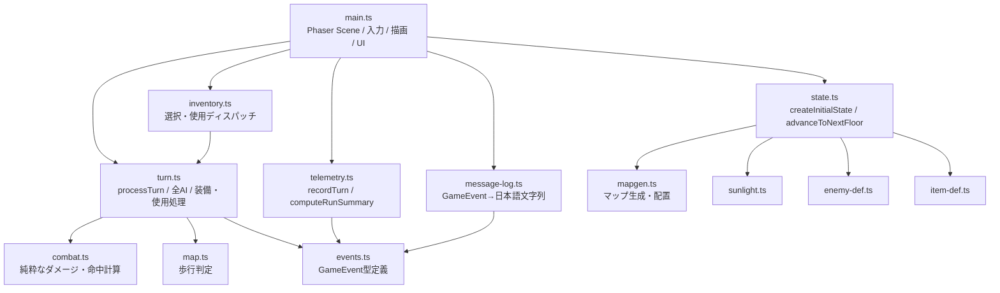
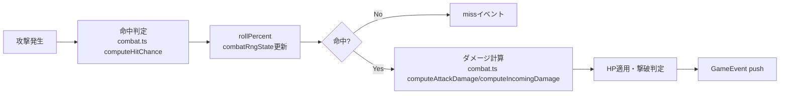

# Phase 10.4a 現行構造監査

## 目的と監査範囲

Phase 10.3.3a完了時点の実装（HEAD `832213b344ad161e8a600b1464e08f3bbc116029`）を対象に、Phase 11～25で予定される機能を追加する上で現行構造が維持可能かを調査した。今回はPhase 10.4の第1段階（調査・分類・改修案作成）のみであり、ゲームコード・テストコード・数値・データ構造は一切変更していない。監査観点は`rogue-of-sun-development-plan.md`（2026-08-01時点のスナップショットとして参照、更新なし）のPhase順序を用い、実装済みの事実はコード・自動テスト・`docs/history/`の各履歴文書を優先した。

## 開始時のrepository、branch、HEAD、working tree

- repository: `sanadamancom/rogue-of-sun`（一致）
- branch: `main`（一致）
- local HEAD: `832213b344ad161e8a600b1464e08f3bbc116029`（expected_headと一致）
- origin/main: 同一コミット、進行なし
- working tree: clean

## baseline結果

- `docs/history/phase-10-3-3a-healing-field-name-fix.md`存在、`actualHealing`実装済みを確認
- `npx tsc --noEmit`：エラーなし
- `npx vitest run`：48ファイル / 996件、全成功
- `npx vite build`：成功

期待値（48ファイル・996件）と完全一致。停止条件への該当なし。

## 参照した実装・テスト・履歴

`src/game/types.ts`、`state.ts`、`turn.ts`、`combat.ts`、`map.ts`、`mapgen.ts`、`inventory.ts`、`item-def.ts`、`weapon-def.ts`、`armor-def.ts`、`enemy-def.ts`、`events.ts`、`message-log.ts`、`telemetry.ts`、`sunlight.ts`、`web.ts`、`src/main.ts`、および対応する`src/game/__tests__/`配下のテストファイル一式。履歴文書は`docs/history/phase-10-2-combat-stat-scale-redesign.md`ほか、コード内コメントが参照する各Phase文書を実体確認に利用した。

## 現行モジュール構成図

`turn.ts`（72K、約1719行）が全プレイヤー行動処理・全9種族AI・装備/使用処理・`processTurn`本体を単一ファイルに保持している点が最も目立つ集中箇所。

## 主要状態の所有関係

| 状態 | 所有箇所 | 備考 |
|---|---|---|
| ラン全体（runSeed, totalFloors） | `GameState`直下 | フロア跨ぎで不変 |
| 現在フロア（floor, seed, exit） | `GameState`直下 | `advanceToNextFloor`で再構築 |
| 生成済みマップ | `GameState.map`（`GameMap.terrain[y][x]`） | 地形専用2次元配列、他レイヤーと分離 |
| プレイヤー状態 | `GameState.player: Actor` | 位置はマス配列に埋め込まず`Vec2`で保持 |
| 敵状態 | `GameState.enemies: EnemyActor[]` | 種族別一時状態は`EnemyActor`の任意フィールド（`recovering`/`webCooldown`等）に集約、死亡後も配列に残留（`alive: false`） |
| アイテム（床） | `GameState.groundItems: GroundItem[]` | `map.terrain`へ埋め込まない設計方針が明文化済み |
| アイテム（所持） | `GameState.inventory: Record<ItemId, number>` | 個体管理なしのスタック数モデル |
| 一時状態（毒等は未実装） | `EnemyActor`の任意フィールド、`GameState.hammerRecovery`等 | 種族固有・武器固有ごとに専用フィールドを追加する一貫パターン |
| 戦闘乱数 | `GameState.combatRngState: number` | マップ生成用RNG群とXOR定数で完全分離、独立ストリーム |
| マップ生成乱数 | `state.ts`内でXOR定数ごとに`createRng`を都度生成 | 配置・種族・各アイテムごとに専用ストリームを個別生成（後述） |
| テレメトリ状態 | `RunTelemetry`（`telemetry.ts`、main.ts側で保持） | `GameState`と別インスタンス、`recordTurn`はGameStateを読むのみで変更しない |

重複保持は確認されなかった。描画専用状態（`main.ts`のスプライト参照等）とゲーム進行状態（`GameState`）の混在も確認されなかった。

## ライフサイクル維持・初期化表

| 状態・値 | 新規ラン時 | フロア移動時 | 死亡時 | 再挑戦時（Enter） | 将来セーブ復元時の想定 |
|---|---|---|---|---|---|
| map / enemies / webs / groundItems | 新規生成 | 新規生成 | `restart`で新規生成 | 同一seedで新規生成 | 保存対象（決定論的復元も理論上可） |
| player.hp/maxHp/attack/defense/accuracy/evasion/facing | 初期値 | `CarryOverStats`で維持 | 初期値へ | 初期値へ | 保存対象 |
| regenProgress | 0 | 維持 | 0へ | 0へ | 保存対象 |
| inventory / equippedWeaponId / equippedArmorId | 空/null | 維持 | 空/nullへ | 空/nullへ | 保存対象 |
| hammerRecovery | false | **false（毎フロア初期化）** | false | false | 保存不要（一時状態） |
| solarEnergy / maxSolarEnergy / solUnlocked / selectedEnchantment | 初期値 | 維持 | 初期値へ | 初期値へ | 保存対象 |
| combatRngState | `runSeed ^ 0x4e6d3a17` | 維持（既に進行済みの値） | 再シード | 再シード | 保存対象（再現性に必須） |
| sunlight | 毎フロア再生成 | 再生成 | 再生成 | 再生成 | 保存不要（マップから再計算可能） |

根拠: `src/game/state.ts`の`buildFloorState`（77-320行）、`advanceToNextFloor`（333-353行）、`src/main.ts`の`restart`（1046-1054行）。ライフサイクル規則は全項目でコメントにより明文化されており、規則が不明瞭な値は確認されなかった。

## 戦闘処理の現行フロー

共通処理: `combat.ts`の`computeHitChance`/`computeAttackDamage`/`computeIncomingDamage`/`resolvesAsHit`は純粋関数として一元化され、プレイヤー攻撃（`turn.ts applyPlayerAttackToEnemy`）・通常敵近接（`tryMeleeAttack`/`resolveEnemyAttackHit`）・太陽銃（`resolveSolarGunAttack`）が共通してこれを呼ぶ。射程・攻撃可能判定と追加効果・撃破処理は経路ごとに個別関数として実装されている（`resolveSpiderEnemy`のweb設置、`resolveCockatriceEnemy`の睨み、`resolveKrakenEnemy`の触手等）。

重複: 「命中ロール→ダメージ計算→HP適用→イベントpush」という4ステップの並びは各経路で個別に手書きされており、共有ヘルパー関数への集約はされていない（例: `applyPlayerAttackToEnemy`145-212行、`resolveEnemyAttackHit`780-806行）。ただし各経路の分岐条件（種族固有のタイミング制御）が強く異なるため、現時点で無理に統合すると条件分岐が複雑化するリスクがある。

UI・ログとの結合: `GameEvent`型（`events.ts`）を経由してのみログ・演出へ伝搬しており、`turn.ts`側が直接文字列や描画命令を生成することはない（`message-log.ts`が唯一のフォーマッタ）。

## アイテム定義・個体・所在の現行構造

- 定義データ: `item-def.ts`/`weapon-def.ts`/`armor-def.ts`にID（`ItemId`/`WeaponId`/`ArmorId`の文字列リテラルユニオン）をキーとした`Record`で分離。表示名・カテゴリ（`ITEM_DEFINITIONS[id].category`）と戦闘数値（`WEAPON_DEFINITIONS`/`ARMOR_DEFINITIONS`）も分離されている。
- 所持データ: `GameState.inventory: Record<ItemId, number>` — スタック数のみ、個体差（耐久度等）なし。
- 床データ: `GameState.groundItems: GroundItem[]`（`id`/`itemId`/`pos`）。
- 拾得: `turn.ts`397-421行、移動先座標一致で自動拾得。**所持上限チェックは存在しない**（無条件で`inventory[itemId]++`）。
- 個体管理: 現状「同種複数所持」はカウントで表現可能（既にスタック数モデル）。装備・投擲・破棄は未実装。

Phase 11開始前に直す必要がある範囲: なし。所持上限チェックと「置く・捨てる」処理はPhase 11自体の実装作業であり、既存のスタック数モデル・`groundItems`配列構造に対する追加のみで実現可能（構造の作り直しは不要）。

## マップデータ層の現行構造

| 層 | 実装状況 |
|---|---|
| terrain | `GameMap.terrain[y][x]: Tile`、独立2次元配列 |
| fixture | `exit: Vec2`としてGameMap直下に単一値のみ実装。`Fixture`型自体は`'exit'|'trap'|'chest'`を持つが、`trap`/`chest`は未生成（`types.ts`38-42行のコメントで明記） |
| actor | `player.pos`/`enemy.pos`として個別オブジェクトが保持、マス配列に埋め込まない |
| ground_item | `GameState.groundItems`配列、マス配列に埋め込まない |
| sunlight | `GameState.sunlight[y][x]: boolean`、terrainとは独立した2次元配列、毎フロア再生成 |
| exploration | 未実装 |
| trap / visibility | 未実装 |

1マスに複数カテゴリが共存できる構造か: terrain・sunlight・actor・ground_itemは各々独立配列/オブジェクトのため共存可能。fixtureのみ「単一exit座標」という特殊構造であり、Phase 16（罠・発見状態）で複数fixtureを一般化する際は`exit: Vec2`を`fixtures: FixtureTile[]`のような配列へ拡張する設計変更が必要になる。ただしこれは現行の`exit`利用箇所（数箇所、`map.exit`参照）を書き換える程度で足り、Phase 11着手を妨げるものではない。

## 描画・UI・ログ・テレメトリとの境界

- ゲームロジック（`turn.ts`/`state.ts`/`combat.ts`）はCanvas描画・HTML UIへ直接触れない。
- `main.ts`はPhaserのScene実装として、`processTurn`の戻り値（`TurnResult.events`）を読んで演出・スプライト更新のみ行う（例: 974行付近の`advanceToNextFloor`呼び出し、1024-1043行のミス演出）。
- `telemetry.ts`の`recordTurn`/`snapshotForTurn`は`GameState`を読み取るのみで、`GameState`や`combatRngState`を変更しない（コード確認済み、副作用は`RunTelemetry`側のみ）。
- `message-log.ts`は`GameEvent`から日本語文字列への変換のみを担当し、ゲーム進行へ影響しない。

Phase 23・24（演出・UI・音、タイトル・セーブ）で分離が必要になる箇所: 現状でも境界は保たれているため、大きな崩し込みは見当たらない。強いて言えば`main.ts`が2000行規模で描画・入力・UI状態・telemetry呼び出し・シーン遷移を一括して持っており、Phase 23以降の演出追加でさらに肥大化する可能性がある（ファイルが大きいこと自体を理由に分割必須とはしない）。

## 将来セーブに対する直列化可能性

`GameState`の全フィールドはプレーンなオブジェクト・配列・数値・真偽値・文字列リテラルで構成されており、`Map`/`Set`/関数参照/クラスインスタンス/循環参照は確認されなかった（`types.ts`全体を確認）。`combatRngState`もクロージャではなく`number`として保持されている（コメントで明記）。したがって現時点のGameStateは構造上JSONへそのまま保存可能であり、Phase 24まで変換作業を延期しても構造上の問題はない。ただし今回はセーブ機能・保存スキーマの実装は行っていない。

## Phase 11～25対応表

| Phase | 必要になる概念 | 現行構造で対応可能か | 不一致 | 修正時期 | 根拠 |
|---|---|---|---|---|---|
| 11 | 所持上限、置く・捨てる、満腹度、食料、飢餓 | 可能（追加のみ） | 拾得に上限チェックなし（`turn.ts`400-421行） | Phase 11実装時 | `inventory.ts`, `turn.ts` |
| 12 | 一時効果、毒、鈍足、暗闇、封印 | 可能（既存パターンの延長） | なし。`Actor.slowed`/`petrified`等の任意フィールド追加パターンが既に確立 | Phase 12実装時 | `types.ts`93-233行 |
| 13 | 経験値、レベル、成長ポイント、4能力 | 可能 | `Actor`に基礎値フィールドを追加する程度 | Phase 13実装時 | `types.ts` Actor定義 |
| 14 | 属性、弱点・耐性、近接エンチャント、SOL消費 | 部分的に注意が必要 | `computeAttackDamage`/`computeIncomingDamage`は乗算的な属性倍率を想定していない単純な加減算 | Phase 14実装時（関数シグネチャ拡張） | `combat.ts`38-49行 |
| 15 | 探索状態、視界、暗い区画 | 可能 | exploration層が未実装（新規追加） | Phase 15実装時 | `types.ts` GameMap |
| 16 | 罠、発見状態 | 部分的に注意が必要 | `exit: Vec2`が単一値、fixture一般化が必要 | Phase 16実装時 | `types.ts`42-58行 |
| 17 | 敵固有能力、遠距離攻撃、敵レベルアップ | 可能 | 種族別任意フィールドパターンの延長 | Phase 17実装時 | `types.ts` EnemyActor |
| 18 | カード | 情報不足 | 現行に類似構造なし、設計未着手 | Phase 18計画時に要詳細検討 | なし（未確認事項） |
| 19 | モンスターハウス | 可能 | 配置ロジックの追加のみ | Phase 19実装時 | `mapgen.ts`, `state.ts` |
| 20 | 投擲、衝突、床への落下 | 可能 | ground_item層が既に独立しているため着地処理を追加しやすい | Phase 20実装時 | `types.ts` GroundItem |
| 21 | 完成版のラン構成 | 可能 | `totalFloors`/`floor`が既に一般化済み | Phase 21実装時 | `types.ts` GameState |
| 22 | 装備、太陽鍛冶、報酬 | 可能 | 既存の装備スロットパターン（weapon/armor）の延長 | Phase 22実装時 | `state.ts` CarryOverStats |
| 23 | 背景、攻撃演出、UI、音 | 可能だが要監視 | `main.ts`肥大化の継続リスク | Phase 23着手時に分割要否を再判断 | `main.ts`（約2000行） |
| 24 | タイトル、設定、セーブ、リザルト | 可能 | GameStateの直列化可能性は確認済み | Phase 24実装時 | 本文書「将来セーブに対する直列化可能性」節 |
| 25 | 総合バランス、回帰試験、公開 | 可能 | 既存テスト基盤（vitest, 48ファイル）の拡張 | Phase 25実装時 | `src/game/__tests__/` |

Phase 14・16は「不一致」を明記しているが、いずれも各Phase着手時点での関数拡張・型拡張で対応可能であり、Phase 11開始前の先行対応は不要と判断した（具体的な故障経路が現時点では存在しないため）。

## 現状のまま維持できるもの

- `combat.ts`の純粋関数群（命中・ダメージ計算の一元化）
- `events.ts`/`message-log.ts`によるロジック・表示の分離
- 定義データ（`enemy-def.ts`/`weapon-def.ts`/`armor-def.ts`/`item-def.ts`）の安定ID設計
- `state.ts`のフロア遷移・再挑戦時の状態初期化/維持パターン（`CarryOverStats`）
- マップの`terrain`/`sunlight`/`actor`/`ground_item`層分離
- `telemetry.ts`の読み取り専用設計（GameState非破壊）
- GameStateの直列化可能な構造（Map/Set/関数参照/循環参照なし）

## Phase 11前に修正が必要なもの

該当なし。具体的な故障経路または手戻りを示せる項目は確認されなかった。

## 各機能の実装時まで延期できるもの

- 所持上限チェックの追加（Phase 11）
- fixture層の一般化（`exit`単一値→配列、Phase 16）
- 属性・弱点耐性のための`combat.ts`関数シグネチャ拡張（Phase 14）
- exploration/visibility層の新規追加（Phase 15）
- セーブ用シリアライズ処理の実装（Phase 24）
- `main.ts`の分割要否再検討（Phase 23着手時）

## 必要最小限のリファクタリング案

Phase 11開始前に必須と判定した変更はないため、リファクタリング提案は「なし」。強いて予防的に触れるなら、`turn.ts`（1719行）が今後のPhase 12以降でさらに肥大化する可能性はあるが、現行テスト（996件）が挙動を保護しており、Phase 11自体の実装を妨げる要因ではないため今回は変更提案の対象外とした。

## 変更候補ファイル

なし（Phase 11実装時に`turn.ts`/`inventory.ts`/`types.ts`へ追加予定、今回は対象外）。

## 追加すべき回帰テスト

Phase 11実装時に以下の観点のテスト追加を推奨（今回は未実装）:
- 所持上限到達時の拾得拒否/床残留
- 捨てたアイテムが`groundItems`へ正しく戻ること
- 満腹度0到達時の挙動

## Phase 10.4b以降の推奨分割

- 10.4b: Phase 11（所持上限・食料）着手前の実装タスクそのもの（今回の監査は変更不要と判定したため、10.4bは純粋な機能追加として起票可能）
- 10.4c（任意）: Phase 18（カード）着手前の設計検討タスク。現行構造に類似物がなく、監査時点では「未確認事項」として保留

## 監査でコード・数値を変更していないこと

`git diff --check`・`git status --short`で確認する通り、変更は本監査履歴ファイル1件のみ。ゲームコード・テストコード・型定義・データ定義・数値バランス・テレメトリschema・乱数呼び出し順のいずれも変更していない。

## 未確認事項と判断保留事項

- Phase 18（カード）に対応する現行構造上の類似物は確認できず、対応可否は保留。Phase 18計画時に別途詳細調査が必要。
- Phase 23で`main.ts`の分割が必要になるかどうかは、実際に追加される演出量に依存するため、現時点では判断を保留する。
